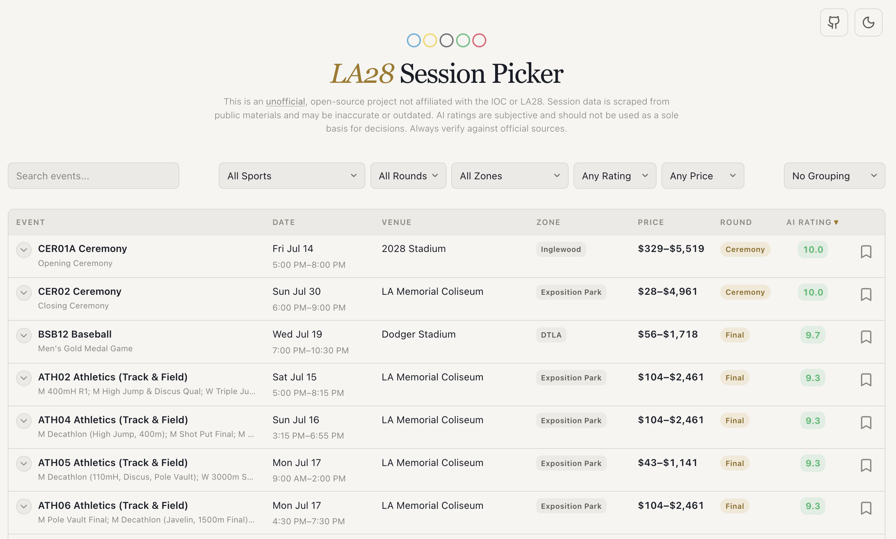

> **Disclaimer:** This is an unofficial, open-source project and is not affiliated with, endorsed by, or connected to the International Olympic Committee (IOC), LA28 Organizing Committee, or any official Olympic body. Session data is scraped from publicly available schedules and materials and may be inaccurate, incomplete, or outdated. Always verify details against official sources before making any plans or purchasing decisions. Use at your own risk.

# LA28 Unofficial Session Picker

After being selected for the LA28 Olympics local presale, I found myself overwhelmed with the options. 800+ sessions! 40+ venues!

I vibe-coded a better session browser, but I still needed help deciding where to allocate my precious 12 slots. I had Claude come up with a multidimensional system to rank the events (see [AI Ratings Methodology](#ai-ratings-methodology)) and then populate them with easy-to-understand summaries/rating explanations.

This ended up being hugely helpful for me when buying tickets, so I hope it helps you too!

## Resources Used

- [LA 2028 Session Table](https://docs.google.com/spreadsheets/d/1bJJc__Bt_VgBkZw3jZAMHKmoP3Q5Wdq5I9sA4vzLsws/htmlview?gid=798256147&pru=AAABnY8tXA0*s67VGSR_thwjEPBNJ8734g#gid=798256147) (Google Sheets) — primary source of session data.
- [Official competition schedule](https://la28.org/content/dam/latwentyeight/competition-schedule-imagery/uploaded-nov-12-2025/LA28OlympicGamesCompetitionScheduleByEventV2.pdf) (PDF) — used to cross-reference and verify session data against LA28's published schedule.

## Special Thanks

- [u/type_rex_](https://www.reddit.com/r/olympics/comments/1sc3a21/la28_google_doc_session_codes_current_prices_and/) — for the session table Google Sheet.
- [u/polygon06](https://www.reddit.com/r/olympics/comments/1scjk1s/interactive_la28_schedule_explorer/) — whose schedule explorer inspired me to share this project.

## AI Ratings Methodology

Each session carries **precomputed scores** from a rule-based system in `[src/lib/ratings.ts](src/lib/ratings.ts)`. The methodology is opinionated: it is meant to surface interesting sessions, not to be official or authoritative. **Ticket price is not part of the rating**; it stays in the table so you can judge value yourself.

### Dimensions and weights

Every dimension is scored on a 1–10 scale. The **aggregate** is a weighted average of the five (shown in the UI to one decimal place).

| Dimension        | Weight | What it reflects                                                                                                                                                                  |
| ---------------- | ------ | --------------------------------------------------------------------------------------------------------------------------------------------------------------------------------- |
| **Significance** | 30%    | How much the session matters in an Olympic context: round type (e.g. gold medal vs preliminary), sport popularity tier, and whether multiple finals/medals happen in one session. |
| **Experience**   | 25%    | How strong the live-watch experience is likely to be: per-sport watchability blended with venue quality, scaled by round importance; small evening boost for high-energy sports.  |
| **Star power**   | 15%    | Base draw of the sport for globally recognized athletes, adjusted by round (later rounds score higher; early rounds lower).                                                       |
| **Uniqueness**   | 15%    | Rarity of the opportunity: bonuses for new/returning sports on the program, iconic venue pairings (for meaningful rounds), ceremonies.                                            |
| **Demand**       | 15%    | How hot tickets are likely to be: sport-level demand, round, published price ceiling as a signal, plus boosts for standout “cultural moment” combinations.                        |

## Contributing

See [CONTRIBUTING.md](CONTRIBUTING.md) for development setup and guidelines.

## License

[MIT](LICENSE)